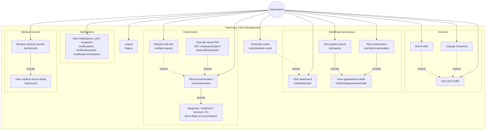
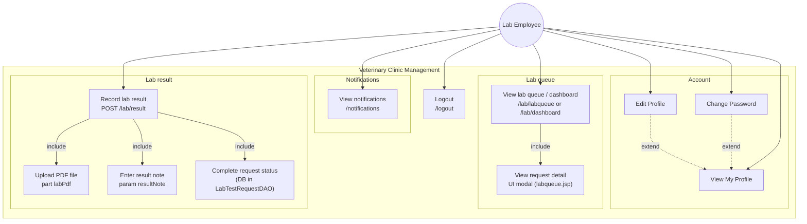

# Use Case – Veterinarian & Lab Employee (đầy đủ)

Tài liệu mô tả use case theo **system boundary** + **«include»** / **«extend»** (cùng phong cách mục 4.1 **Customer**: ví dụ *Update Profile* **extend** *View Profile*).  
Đã **bao gồm My Profile**, chỉnh sửa hồ sơ, đổi mật khẩu, dashboard, thông báo, và các luồng nghiệp vụ **khớp servlet trong repo**.

**Xem sơ đồ:** VS Code/Cursor cài extension **Mermaid**, hoặc push lên GitHub (preview `.md`), hoặc [mermaid.live](https://mermaid.live).  
Dùng từ khóa **`graph TB`** (không dùng `flowchart TB`) để tương thích mermaid.live / bản Mermaid cũ.  
Trên nhánh nối: nhãn **`include`** / **`extend`** tương ứng UML «include» / «extend».

---

## 1. Veterinarian (Bác sĩ thú y)

### 1.1 Bảng use case đầy đủ

| Nhóm | UC ID | Tên (tiếng Anh gợi nhớ) | Mô tả / Route gợi ý |
|------|-------|-------------------------|---------------------|
| **Account** | V-A1 | **View My Profile** | Xem thông tin cá nhân (`/vet/profile`) |
| | V-A2 | **Edit Profile** | Cập nhật họ tên, SĐT, địa chỉ, ảnh đại diện (`/vet/edit-profile`) |
| | V-A3 | **Change Password** | Đổi mật khẩu (`/vet/change-password`) |
| **Notifications** | V-N1 | **View Notifications** | Xem thông báo trong app (trung tâm / dropdown notification) |
| **Dashboard & queue** | V-D1 | **View Dashboard** | Tổng quan lịch trong ngày, chỉ số (`/vet/dashboard`) |
| | V-D2 | **View Patient Queue** | Hàng chờ bệnh nhân (`/vet/queue`) |
| | V-D3 | **View Appointment Detail** | Chi tiết lịch (modal/API `GetAppointmentDetail`) |
| | V-D4 | **Start Examination** | Bắt đầu khám từ hàng chờ (`/vet/start-examination`) |
| **Examination** | V-E1 | **Record Examination** | Màn khám chính (`/vet/examination`) |
| | V-E2 | **Record Diagnosis** | Chẩn đoán & quan sát |
| | V-E3 | **Record Treatment Plan** | Kế hoạch / ghi chú điều trị |
| | V-E4 | **Prescribe Medication** | Đơn thuốc (liều số, tần suất) |
| | V-E5 | **Record Services Used** | Dịch vụ đã chọn (≥1 khi hoàn tất) |
| | V-E6 | **Save Examination Progress** | Lưu nháp (POST không complete) |
| | V-E7 | **Complete Examination** | Hoàn tất khám (chặn nếu lab Pending) |
| | V-E8 | **Request Lab Test** | Tạo yêu cầu xét nghiệm (`/vet/lab-request`) |
| | V-E9 | **View Lab Result** | Xem PDF/modal kết quả (`viewLabRequestId`) |
| | V-E10 | **Add Follow-up Note** | Ghi chú follow-up trong khám (nếu có) |
| **Medical records** | V-M1 | **Browse Medical Records** | Danh sách hồ sơ (`/vet/records`) |
| | V-M2 | **View Medical Record Detail** | Chi tiết một bản ghi (`/vet/record`) |
| **Follow-up** | V-R1 | **Schedule Revisit** | Hẹn tái khám (`/vet/schedule-revisit`) |
| **Session** | V-S1 | **Logout** | Đăng xuất (`GET /logout` — `LogoutServlet`) |

### 1.2 Quan hệ «include» / «extend» (khuyến nghị)

- **Account (giống Customer)**  
  - *Edit Profile* **«extend»** *View My Profile* (cập nhật là hành động mở rộng khi đã xem/khởi từ profile).  
  - *Change Password* **«extend»** *View My Profile* (thường vào từ màn profile / cùng nhóm cài đặt tài khoản).  
- **Queue**  
  - *View Patient Queue* **«include»** *View Appointment Detail* (khi mở chi tiết từ hàng chờ).  
  - *Start Examination* **«include»** *View Appointment Detail* (hoặc ít nhất xác nhận đúng lịch trước khi vào khám).  
- **Examination**  
  - *Record Examination* **«include»** *Record Diagnosis*, *Record Treatment Plan*, *Prescribe Medication*, *Record Services Used* (theo rule nghiệp vụ trước khi *Complete*).  
  - *Request Lab Test*, *View Lab Result*, *Add Follow-up Note*, *Save Examination Progress*, *Complete Examination* **«extend»** *Record Examination*.  
- **Medical records**  
  - *Browse Medical Records* **«include»** *View Medical Record Detail* (khi chọn một bản ghi).  
- **Follow-up**  
  - *Schedule Revisit* **«extend»** *View Dashboard* hoặc *View Patient Queue* (sau khi khám / từ dashboard).  

> **Lab:** Bác sĩ **không** upload file xét nghiệm; chỉ **xem** kết quả do Lab Employee gửi (PDF).

### 1.3 Sơ đồ Mermaid – Veterinarian

> **Ghi chú:** *View Lab Result* dùng cùng servlet `VetExaminationServlet` với tham số `viewLabRequestId` (GET). Các phần tử con diagnosis / services / prescription là **màn hình con** trong một UC *Record Examination* (không map servlet riêng).

### 1.4 Tham chiếu servlet (Veterinarian) — đúng với code

| Use case (gợi nhớ) | Servlet class | `urlPatterns` / ghi chú |
|--------------------|---------------|-------------------------|
| View My Profile | `VetProfileServlet` | `/vet/profile` |
| Edit Profile | `VetEditProfileServlet` | `/vet/edit-profile` |
| Change Password | `VetChangePasswordServlet` | `/vet/change-password` |
| View Notifications | `NotificationCenterServlet` | `/notifications` |
| Poll / dropdown | `NotificationPollServlet`, `NotificationDropdownServlet` | `/notifications/poll`, `/notifications/dropdown` |
| View Dashboard | `VetDashboardServlet` | `/vet/dashboard` |
| View Patient Queue | `VetPatientsQueueServlet` | `/vet/queue` |
| View Appointment Detail | `VetGetAppointmentDetailServlet` | `/vet/GetAppointmentDetail` |
| Start Examination | `VetStartExaminationServlet` | `/vet/start-examination` |
| Record Examination / View Lab Result | `VetExaminationServlet` | `/vet/examination` (+ query `viewLabRequestId` cho modal PDF) |
| Request Lab Test | `VetLabRequestServlet` | `/vet/lab-request` |
| View lab result file (PDF) | `UploadsLabResultsServlet` | `GET /uploads/lab-results/*` (iframe/link từ examination) |
| Browse Medical Records | `VetMedicalRecordsServlet` | `/vet/records` |
| Medical Record Detail | `VetMedicalRecordDetailServlet` | `/vet/record` |
| Schedule Revisit | `VetScheduleRevisitServlet` | `/vet/schedule-revisit` |
| Logout | `LogoutServlet` | `/logout` |

---

## 2. Lab Employee (Nhân viên xét nghiệm)

### 2.1 Bảng use case đầy đủ

| Nhóm | UC ID | Tên | Mô tả / Route |
|------|-------|-----|----------------|
| **Account** | L-A1 | **View My Profile** | `/lab/profile` |
| | L-A2 | **Edit Profile** | `/lab/edit-profile` |
| | L-A3 | **Change Password** | `/lab/change-password` |
| **Notifications** | L-N1 | **View Notifications** | Thông báo (lab/vet workflow) |
| **Lab workflow** | L-W1 | **View Lab Dashboard / Queue** | Hàng chờ (`/lab/labqueue`, alias `/lab/dashboard`) |
| | L-W2 | **View Lab Request Detail** | Modal/chi tiết request trước khi nhập kết quả |
| | L-W3 | **Record Lab Result** | Gửi kết quả (`POST /lab/result`) |
| | L-W4 | **Upload Result File (PDF)** | Chỉ PDF |
| | L-W5 | **Enter Result Note** | Ghi chú bắt buộc |
| | L-W6 | **Complete Lab Request** | Trạng thái Completed sau khi lưu thành công |
| **Session** | L-S1 | **Logout** | `GET /logout` |

### 2.2 Quan hệ

- *Edit Profile* **«extend»** *View My Profile*; *Change Password* **«extend»** *View My Profile* (cùng logic với Customer/Vet).  
- *View Lab Dashboard / Queue* **«include»** *View Lab Request Detail* (khi xem chi tiết / chọn dòng).  
- *Record Lab Result* **«include»** *Upload Result File (PDF)*, *Enter Result Note*, *Complete Lab Request*.

### 2.3 Sơ đồ Mermaid – Lab Employee

> **Ghi chú:** Một lần **POST /lab/result** thực hiện lưu PDF + ghi chú + cập nhật trạng thái request (Completed) trong code — tách ba UC con trên sơ đồ khối *Record Lab Result*.

### 2.4 Tham chiếu servlet (Lab Employee) — đúng với code

| Use case (gợi nhớ) | Servlet class | `urlPatterns` / ghi chú |
|--------------------|---------------|-------------------------|
| View My Profile | `LabProfileServlet` | `/lab/profile` |
| Edit Profile | `LabEditProfileServlet` | `/lab/edit-profile` |
| Change Password | `LabChangePasswordServlet` | `/lab/change-password` |
| View Notifications | `NotificationCenterServlet` | `/notifications` |
| View Lab Queue | `LabDashboardServlet` | `/lab/labqueue`, `/lab/dashboard` |
| Record Lab Result | `LabUploadResultServlet` | `POST /lab/result` (multipart: `labPdf`, `resultNote`, …) |
| Serve result file | `UploadsLabResultsServlet` | `/uploads/lab-results/*` |
| Logout | `LogoutServlet` | `/logout` |

---

## 3. Gợi ý chèn RDS

- **4.2 UCs for Veterinarian** – dùng bảng 1.1 + **§1.3 Mermaid** + bảng **§1.4**.  
- **4.x UCs for Laboratory Staff** – dùng bảng 2.1 + **§2.3 Mermaid** + bảng **§2.4**.  
- Giữ thống nhất với **Customer**: nhóm **View Profile → Edit Profile (extend)** và **Change Password** cùng cụm Account.

---

## 4. Hướng dẫn tự vẽ (Draw.io / giấy / PowerPoint)

### 4.1 Ký hiệu (chuẩn use case)

| Thành phần | Cách vẽ |
|------------|---------|
| **Actor** | Hình người que (stick figure), **đặt ngoài** khung hệ thống. |
| **Hệ thống** | Một **hình chữ nhật lớn**; tiêu đề trên cùng: *Veterinary Clinic Management*. |
| **Use case** | **Hình oval** bên trong khung; tên ngắn (VD: *View My Profile*). |
| **Liên kết Actor → UC** | Đường thẳng nối actor tới các UC mà người đó **trực tiếp** dùng. |

### 4.2 «include» và «extend» (chỉ vẽ giữa các oval)

- **«include»** — luồng **bắt buộc** / luôn có phần đó: vẽ mũi tên **nét liền** từ UC **A** → UC **B**, ghi `<<include>>` (A *gọi* / *có* B).  
  *Ví dụ:* *View patient queue* **include** *View appointment detail* (mở chi tiết là một phần của xem hàng chờ).

- **«extend»** — **tùy chọn** / khi thỏa điều kiện: vẽ mũi tên **nét đứt** từ UC **mở rộng** → UC **gốc**, ghi `<<extend>>`.  
  *Ví dụ:* *Edit profile* **extend** *View profile* (chỉnh sửa là mở rộng khi đã có xem profile).

> Nếu chỉ cần đơn giản: **include = nét liền**, **extend = nét đứt** + nhãn.

### 4.3 Thứ tự vẽ (5 bước)

1. Vẽ **khung** + tên hệ thống.  
2. Vẽ **actor** bên trái ngoài khung.  
3. Vẽ các **oval** theo **checklist** bên dưới (chia nhóm: Account / Thông báo / Hàng chờ / Khám / Hồ sơ — khỏi chen chúc).  
4. Nối **actor → oval** (chỉ những UC trực tiếp).  
5. Vẽ **include/extend** giữa các oval theo mục **1.2** và **2.2** (hoặc theo sơ đồ Mermaid §1.3 / §2.3).

### 4.4 Checklist oval — Veterinarian (chép vào giấy rồi tick)

**Account:** View My Profile · Edit Profile · Change Password  

**Thông báo:** View Notifications  

**Dashboard & hàng chờ:** View Dashboard · View Patient Queue · View Appointment Detail · Start Examination  

**Khám:** Record Examination · (bên trong khám có chẩn đoán / dịch vụ / đơn — có thể gộp 1 oval *Record examination* hoặc tách 4 oval nhỏ nối **include** vào *Record examination*) · Request lab test · View lab result  

**Hồ sơ:** Browse medical records · View medical record detail  

**Khác:** Schedule revisit · Logout  

### 4.5 Checklist oval — Lab Employee

**Account:** View My Profile · Edit Profile · Change Password  

**Thông báo:** View Notifications  

**Lab:** View lab queue · View request detail · Record lab result · (tuỳ chọn tách 3 oval nhỏ: Upload PDF · Enter note · Complete request — đều **include** vào *Record lab result*)  

**Khác:** Logout  

### 4.6 Công cụ gợi ý

- **draw.io (diagrams.net)** — template UML / blank, kéo oval + actor.  
- **PowerPoint / Word** — Insert Shapes: oval, rectangle, connector.  
- **Giấy** — phác khung trước, oval sau, cuối cùng mới vẽ mũi tên include/extend.

Chi tiết **đường dẫn servlet** khi cần ghi chú dưới hình: dùng bảng **§1.4** và **§2.4**.
